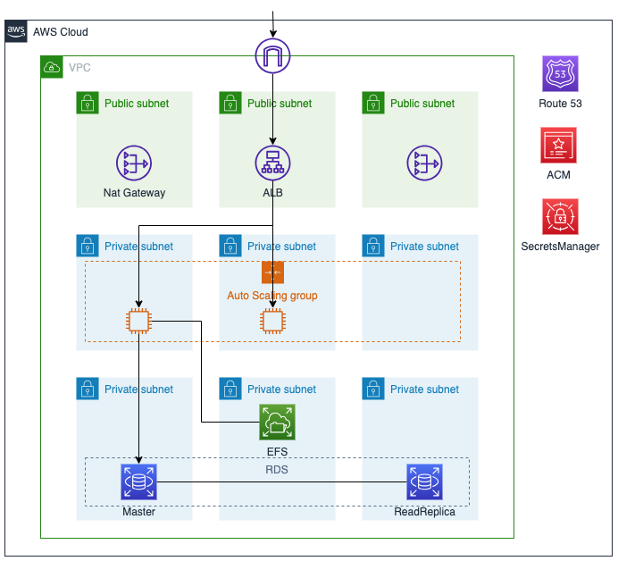

# README

## 構成図


## デプロイ手順
### 1. `parameter.ts`を編集
myIPAddrやdomainName等を編集.

### 2. CDKプロジェクトにコピー
- `bin/three_tier_high_availability.ts` ... bin/にコピー.
- `lib/three_tier_high_availability-stack.ts` ... lib/にコピー.
- `parameter.ts` ... CDKプロジェクトフォルダにコピー.

### 3. デプロイ
```bash
cdk synth 
cdk deploy
```